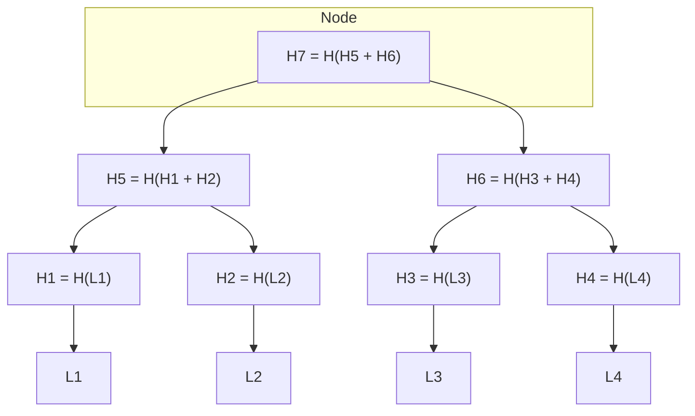
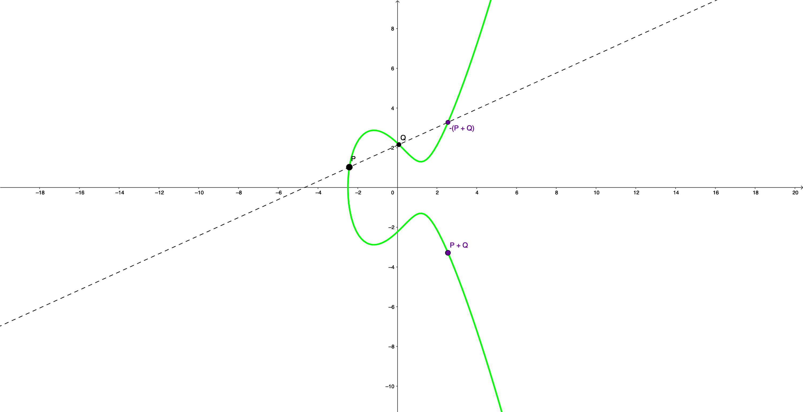
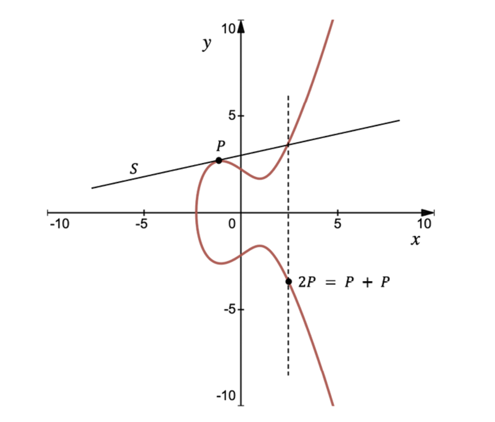

# Mathematical and Technical Exploration of Ehtereum Blockchain

## Hash functions and Merkle Trees

### General properties of hash functions

A hash function is a type of function that has a particular use in the field of computer science and information security.

### Definition

A hash function $H$ is a process that takes an input value of any length $x$ and returns a fixed-size string of bytes $H(x)$ , typically a digest that appears random. The output, called the hash value, should be the same length regardless of the length of the input and should look random. A good hash function also makes it computationally infeasible to regenerate the original input value given the hash value, and to generate two different inputs that produce the same hash value.

### Mathematical Representation

A hash function can be represented as follows:

$$
H: \{0, 1\}^* \rightarrow \{0, 1\}^n
$$

where ${0, 1}^*$ is the set of all possible inputs (of any length) and ${0, 1}^n$ is the set of all possible outputs (of fixed length $n$).

### Properties

Hash functions have certain properties that make them useful in cryptography and data integrity verification:

#### Deterministic

The same input should always produce the same output.

$$
\forall x, y \in \mathcal{M}, x = y \Rightarrow H(x) = H(y)
$$

#### Pre-image Resistance

It should be computationally infeasible to reverse engineer the original input value given the hash value.

$$
\forall h \in H(\mathcal{M}), \nexists x \in \mathcal{M} : H(x) = h
$$

#### Second Pre-image Resistance

It should be computationally difficult to find a second input that produces the same hash value as a given input.

$$
\forall x \in \mathcal{M}, \nexists y \in \mathcal{M}, x \neq y : H(x) = H(y)
$$

#### Collision Resistance

It should be computationnaly difficult to find two different inputs that produce the same hash value.

$$
\nexists x, y \in \mathcal{M}, x \neq y : H(x) = H(y)
$$

#### Uniform Distribution

The hash values should be uniformly distributed over the output space, meaning every hash value in the ouput space is equally likely to occur.

$$
\forall h \in H(\mathcal{M}), P(H(x) = h) = \frac{1}{|H(\mathcal{M})|}
$$

#### Avalanche Effect

A small change in the input should result in a significant change in the output.

$$
\forall x, y \in \mathcal{M}, x \neq y \Rightarrow H(x) \neq H(y) \text{ and } d(H(x), H(y)) \approx \frac{|H(\mathcal{M})|}{2}
$$

where \(d\) is the Hamming distance.

The formula for the Avalanche Effect is not strictly mathematical but attempts to capture the essence that a small change in the input should produce such a drastic change in output that the new hash value appears uncorrelated with the old hash value.

The [Hamming distance](https://en.wikipedia.org/wiki/Hamming_distance) $d(H(x), H(y))$ measures how different two strings of equal length are.

### Example: Sum of ASCII values

Consider a simple hash function that adds the ASCII values of the characters in a string and returns the sum modulo 256. This hash function is not cryptographically secure, but it is useful for illustrating the properties of hash functions.

$$
H(x) = \sum_{i=0}^{n-1} x_i \mod 256
$$

where $x_i$ is the ASCII value of the $i$th character in the string $x$.

Python implementation:
```python
def hash(x):
	return sum([ord(c) for c in x]) % 256
```

### Keccak-256

Keccak-256 is a cryptographic hash function that is used in the Ethereum blockchain. It is a member of the Keccak family of hash functions, which was selected as the winner of the NIST hash function competition in 2012. It has been chosen as SHA-3, the lastest member of the [Secure Hash Algorithm family](https://en.wikipedia.org/wiki/Secure_Hash_Algorithms) of hash functions.

The implementation of this hash function is notably complex, yet an example of it is available in the core Solidity library on [GitHub](https://github.com/ethereum/solidity/blob/develop/libsolutil/Keccak256.cpp).

## Merkle Trees

### Definition

A Merkle tree is a binary tree where each non-leaf node is the hash of its children, and each leaf node is the hash of some data block. It serves as a powerful tool to verify the integrity of data blocks in a dataset, particularly useful in distributed systems like blockchains.

### Mathematical Representation

A Merkle tree $T$ can be represented as a complete binary tree where eahc node $v$ contains a hash $H(v)$.

For any node $v$ at depth $d$:

- If $v$ is a lead node, then $H(V) = H(D(V))$, where $D(v)$ is the data block associated with the leaf node.
- If $v$ is an internal node with childer $l$ and $r$, then $H(v) = H(H(l) + H(r))$.

### Properties

#### Data integrity

Changing a single data block necessitates the recalculation of hashes up to the root, making data tampering evident.

#### Efficient verification

Given a data block and its pathway to the root, the integrity of the data block can be verified without examining the entire tree.

#### Collapsibility

Branches of the tree can be summarized into a single hash, reducing the amount of data that needs to be stored or transmitted.

### Example: a Simple Merkle Tree

Consider a simple Mergkle tree with 4 leafs $L_1$, $L_2$, $L_3$, $L_4$.

$$
\forall i \in \{1, 2, 3, 4\} : H_i = H(L_i)
$$

Internal nodes are:

- $H_5 = H(H_1 + H_2)$
- $H_6 = H(H_3 + H_4)$

The root is:

- $H_7 = H(H_5 + H_6)$



## Elliptic curve cryptography

Elliptic curves are a fundamental part of the cryptographic algorithms used in Ethereum, specifically for generating and managing cryptographic keys and signatures.

### Definition of elliptic curves

Elliptic curves are a type of algebraic curve define over a field $F$ by an equation of the form:

$$
y^2 = x^3 + ax + b
$$

where $a$ and $b$ are constants are elements of $F$ and $4a^3 + 27b^2 \neq 0$, ensuring that the curve has no singular points (i.e. no cusps or self-intersections).

This is referred to as the **Weierstrass equation**.


### Elliptic curve on a finite field

When elliptic curves are used in cryptography they are often defined over finite fields, which are set of numbers with a finite count. There are two types of finite fields: prime fields ($\mathbb{F}_p$) and binary fields ($\mathbb{F}_{2^m}$). The field used in Ethereum is a prime field.

### Elliptic curve over a prime field ($\mathbb{F}_p$)

In a prime field $\mathbb{F}_p$, where $p$ is a prime number, the elements are integers in the range $\{0, 1, \ldots, p-1\}$.

The equation of the elliptic curve over $\mathbb{F}_p$ is the same as the equation of the elliptic curve over the real numbers, but all operations are performed modulo $p$.

$$
y^2 = (x^3 + ax + b) \mod p
$$

### Example: secp256k1 Curve

In the case of the Ethereum, we use the curve secp256k1, which is standardized here: [Standards for Efficient Cryptography Group (SECG)](http://www.secg.org/sec2-v2.pdf).

$$
y^2 = x^3 + 7 \mod 2^{256} - 2^{32} - 2^9 - 2^8 - 2^7 - 2^6 - 2^4 - 1
$$

### Addition on an elliptic curve

Point addition on an elliptic curve is a fundamental operation that underpins elliptic curve cryptography. It is a way to combine two points on the curve to get a third point, also on the curve. This operation has a geometric interpretation involving lines intersecting the curve.

#### Adding Different Points ($P \neq Q$)

- Imagine two points $P$ and $Q$ on the elliptic curve. Draw a straight line through $P$ and $Q$.

- This line will intersect the elliptic curve at a third point $R'$.

- Reflect $R'$ across the $x$-axis to get $R$, which is the result of adding P and Q.

Mathematically, if $P=(x_1,y_1)$ and $Q=(x_2,y_2)$, the slope $m$ of the line through $P$ and $Q$ is given by:

$$
m = \frac{y_2 - y_1}{x_2 - x_1}
$$

The coordinates of the point $R=(x_3,y_3)$, are given by:

$$
x_3 = m^2 - x_1 - x_2
$$

$$
y_3 = m(x_1 - x_3) - y_1
$$



#### Adding a Point to Itself ($P = Q$)

- If you're adding a point to itself, $P+P$, or $2P$ (point doubling›), draw the tangent line to the curve at $P$.

- This line will intersect the curve at a second point $R'$.

- Reflect $R'$ across the $x$-axis to get $R$, which is the result of adding $P$ to itself.

Mathematically, the slope $m$ of the tangent line at $P$ is given by:

$$
m = \frac{3x_1^2 + a}{2y_1}
$$

(where $a$ is the constant in the Weierstrass equation).

The coordinates of the point $R=(x_3,y_3)$ are given by:

$$
x_3 = m^2 - 2x_1
$$

$$
y_3 = m(x_1 - x_3) - y_1
$$



#### Adding the Point at Infinity ($P = \mathcal{O}$)

- In elliptic curve cryptography, the point at infinity $\mathcal{O}$ is the identity element for point addition.

- Adding the point at infinity to a point $P$ results in $P$.

- Formally: $\forall P \in E, P + \mathcal{O} = P$.

### Abelian Group Structure

An elliptic curve, when endowed with the operation of point addition, forms a structure known in mathematics as an abelian group. Here's a breakdown of its properties:

#### Closure

- When you add two points on the elliptic curve, the result is another point on the elliptic curve. This propery is known as closure.

- Formally: $\forall P, Q \in E, P + Q \in E$.

#### Associativity

- The way you group the points does not affect the sum.

- Formally, $(P+Q)+R = P+(Q+R)$.

#### Identity

- There is a special point called the point at infinity, denoted as $\mathcal{O}$, that acts as the identity element for point addition.
When you add any point on the elliptic curve to the point at infinity, you get the original point back.

- Formally: $\forall P \in E, P + \mathcal{O} = P$.

#### Inverse

- Every point ont the elliptic curve has an inverse point that, when added together, result in the point at infinity.

- Formally: $\forall P \in E, \exists Q \in E : P + Q = \mathcal{O}$.

#### Commutativity (Abelian Property)

- The order in which you add the points doesn't matter.

- Formally: $P + Q = Q + P$.

### Discrete Logarithm Problem (DLP)

#### Point multiplication by an integer

- Point multiplication is the operation of adding a point to itself a specified number of times.

- For example, $P + P + \ldots + P = n P$, where $P$ is added $n$ times.

- The addition is not efficient for large value of $n$. However, it can be made efficient using the double-and-add algorithm.

#### Double-and-add algorithm

1. Convert the integer $n$ to its binary representation.

2. Starting from the leftmost bit, double the result and add the point $P$ if the bit is 1.

3. Continue until all bits have been processed.

Example:

Suppose we want to calculate $10P$. The binary representation of 10 is 0b1010. The double-and-add algorithm proceeds as follows:

- Start with $R = P$.

- Now go through each bit of the binary representation of 10, starting from the leftmost bit:
    - First bit (2nd from left) is 0: Double $R$ to get $2P$.
    - Second bit is 1: Double $R$ to get $4P$ and add $P$ to get $5P$.
    - Third bit is 0: Double $R$ to get $10P$.

The result is $10P$, as desired.

This algorithm is efficient because it only requires $O(\log_2 n)$ point additions and doublings, making scalar multiplication computationally feasible even for large values of $n$.

#### Discrete logarithm problem

> The essence of the discrete logarithm problem is that while it is straightforward to compute $Q$ given $n$ and $P$ through the expression $Q=nP$, reversing this process to determine the integer $n$ given $Q$ and $P$ is computationally very challenging. This asymmetry forms the foundation for the security underpinning elliptic curve cryptography.

### Digital signatures

### Public key cryptography


