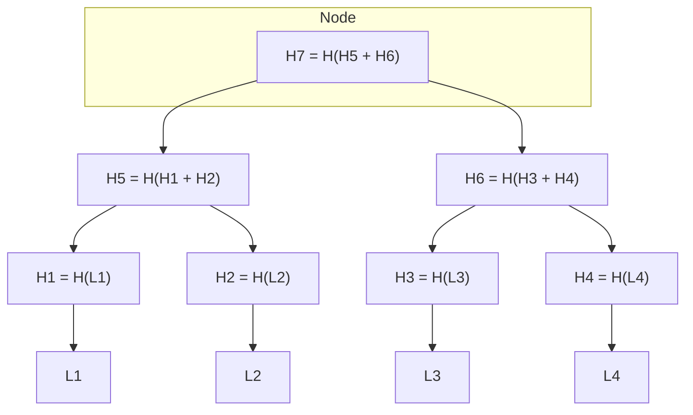

# Mathematical and Technical Exploration of Ehtereum Blockchain

## Hash functions and Merkle Trees

### General properties of hash functions

A hash function is a type of function that has a particular use in the field of computer science and information security.

### Definition

A hash function $H$ is a process that takes an input value of any length $x$ and returns a fixed-size string of bytes $H(x)$ , typically a digest that appears random. The output, called the hash value, should be the same length regardless of the length of the input and should look random. A good hash function also makes it computationally infeasible to regenerate the original input value given the hash value, and to generate two different inputs that produce the same hash value.

### Mathematical Representation

A hash function can be represented as follows:

$$
H: \{0, 1\}^* \rightarrow \{0, 1\}^n
$$

where ${0, 1}^*$ is the set of all possible inputs (of any length) and ${0, 1}^n$ is the set of all possible outputs (of fixed length $n$).

### Properties

Hash functions have certain properties that make them useful in cryptography and data integrity verification:

#### Deterministic

The same input should always produce the same output.

$$
\forall x, y \in \mathcal{M}, x = y \Rightarrow H(x) = H(y)
$$

#### Pre-image Resistance

It should be computationally infeasible to reverse engineer the original input value given the hash value.

$$
\forall h \in H(\mathcal{M}), \nexists x \in \mathcal{M} : H(x) = h
$$

#### Second Pre-image Resistance

It should be computationally difficult to find a second input that produces the same hash value as a given input.

$$
\forall x \in \mathcal{M}, \nexists y \in \mathcal{M}, x \neq y : H(x) = H(y)
$$

#### Collision Resistance

It should be computationnaly difficult to find two different inputs that produce the same hash value.

$$
\nexists x, y \in \mathcal{M}, x \neq y : H(x) = H(y)
$$

#### Uniform Distribution

The hash values should be uniformly distributed over the output space, meaning every hash value in the ouput space is equally likely to occur.

$$
\forall h \in H(\mathcal{M}), P(H(x) = h) = \frac{1}{|H(\mathcal{M})|}
$$

#### Avalanche Effect

A small change in the input should result in a significant change in the output.

$$
\forall x, y \in \mathcal{M}, x \neq y \Rightarrow H(x) \neq H(y) \text{ and } d(H(x), H(y)) \approx \frac{|H(\mathcal{M})|}{2}
$$

where \(d\) is the Hamming distance.

The formula for the Avalanche Effect is not strictly mathematical but attempts to capture the essence that a small change in the input should produce such a drastic change in output that the new hash value appears uncorrelated with the old hash value.

The [Hamming distance](https://en.wikipedia.org/wiki/Hamming_distance) $d(H(x), H(y))$ measures how different two strings of equal length are.

### Example: Sum of ASCII values

Consider a simple hash function that adds the ASCII values of the characters in a string and returns the sum modulo 256. This hash function is not cryptographically secure, but it is useful for illustrating the properties of hash functions.

$$
H(x) = \sum_{i=0}^{n-1} x_i \mod 256
$$

where $x_i$ is the ASCII value of the $i$th character in the string $x$.

Python implementation:
```python
def hash(x):
	return sum([ord(c) for c in x]) % 256
```

### Keccak-256

Keccak-256 is a cryptographic hash function that is used in the Ethereum blockchain. It is a member of the Keccak family of hash functions, which was selected as the winner of the NIST hash function competition in 2012. It has been chosen as SHA-3, the lastest member of the [Secure Hash Algorithm family](https://en.wikipedia.org/wiki/Secure_Hash_Algorithms) of hash functions.

The implementation of this hash function is notably complex, yet an example of it is available in the core Solidity library on [GitHub](https://github.com/ethereum/solidity/blob/develop/libsolutil/Keccak256.cpp).

## Merkle Trees

### Definition

A Merkle tree is a binary tree where each non-leaf node is the hash of its children, and each leaf node is the hash of some data block. It serves as a powerful tool to verify the integrity of data blocks in a dataset, particularly useful in distributed systems like blockchains.

### Mathematical Representation

A Merkle tree $T$ can be represented as a complete binary tree where eahc node $v$ contains a hash $H(v)$.

For any node $v$ at depth $d$:

- If $v$ is a lead node, then $H(V) = H(D(V))$, where $D(v)$ is the data block associated with the leaf node.
- If $v$ is an internal node with childer $l$ and $r$, then $H(v) = H(H(l) + H(r))$.

### Properties

#### Data integrity

Changing a single data block necessitates the recalculation of hashes up to the root, making data tampering evident.

#### Efficient verification

Given a data block and its pathway to the root, the integrity of the data block can be verified without examining the entire tree.

#### Collapsibility

Branches of the tree can be summarized into a single hash, reducing the amount of data that needs to be stored or transmitted.

### Example: a Simple Merkle Tree

Consider a simple Mergkle tree with 4 leafs $L_1$, $L_2$, $L_3$, $L_4$.

$$
\forall i \in \{1, 2, 3, 4\} : H_i = H(L_i)
$$

Internal nodes are:

- $H_5 = H(H_1 + H_2)$
- $H_6 = H(H_3 + H_4)$

The root is:

- $H_7 = H(H_5 + H_6)$



## Elliptic curve cryptography

Elliptic curves are a fundamental part of the cryptographic algorithms used in Ethereum, specifically for generating and managing cryptographic keys and signatures.

### Definition of elliptic curves

Elliptic curves are a type of algebraic curve define over a field $F$ by an equation of the form:

$$
y^2 = x^3 + ax + b
$$

where $a$ and $b$ are constants are elements of $F$ and $4a^3 + 27b^2 \neq 0$, ensuring that the curve has no singular points (i.e. no cusps or self-intersections).

This is referred to as the **Weierstrass equation**.

In the case of the Ethereum we use the curve secp256k1, where $a = 0$ and $b = 7$.

$$
y^2 = x^3 + 7
$$

### Elliptic curve on a finite field


### Properties of elliptic curves

#### Addition on an elliptic curve


### Digital signatures

### Public key cryptography
